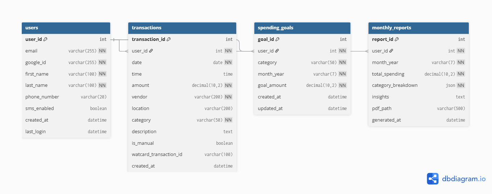

# Domain Model - WatCard Dashboard

**Last Updated**: Nov 4, 2025

---

## Database Tables

### 1. User

| Field | Type | Constraints | Description |
|-------|------|-------------|-------------|
| user_id | INT | PK, AUTO_INCREMENT | Unique identifier |
| email | VARCHAR(255) | UNIQUE, NOT NULL | User email (@uwaterloo.ca) |
| google_id | VARCHAR(255) | UNIQUE, NOT NULL | Google OAuth ID |
| first_name | VARCHAR(100) | NOT NULL | First name |
| last_name | VARCHAR(100) | NOT NULL | Last name |
| phone_number | VARCHAR(20) | NULL | For SMS notifications |
| sms_enabled | BOOLEAN | DEFAULT FALSE | SMS opt-in |
| created_at | DATETIME | DEFAULT NOW | Account creation |
| last_login | DATETIME | NULL | Last login timestamp |

**Relationships**: 1:N with Transaction, SpendingGoal, MonthlyReport

---

### 2. Transaction

| Field | Type | Constraints | Description |
|-------|------|-------------|-------------|
| transaction_id | INT | PK, AUTO_INCREMENT | Unique identifier |
| user_id | INT | FK → User, NOT NULL | Owner |
| date | DATE | NOT NULL | Transaction date |
| time | TIME | NULL | Transaction time |
| amount | DECIMAL(10,2) | NOT NULL, > 0 | Amount in CAD |
| vendor | VARCHAR(200) | NOT NULL | Merchant name |
| location | VARCHAR(200) | NULL | Location |
| category | ENUM | NOT NULL | See categories below |
| description | TEXT | NULL | Optional notes |
| is_manual | BOOLEAN | DEFAULT FALSE | Manual vs scraped |
| watcard_transaction_id | VARCHAR(100) | UNIQUE, NULL | WatCard ID (if scraped) |
| created_at | DATETIME | DEFAULT NOW | Record creation |

**Categories**: Café, ResHalls, Laundry, W Store, Restaurants, Other

**Indexes**: 
- user_id
- date
- category
- (user_id, date)

**Relationships**: N:1 with User

---

### 3. SpendingGoal

| Field | Type | Constraints | Description |
|-------|------|-------------|-------------|
| goal_id | INT | PK, AUTO_INCREMENT | Unique identifier |
| user_id | INT | FK → User, NOT NULL | Owner |
| category | ENUM | NOT NULL | Same as Transaction |
| month_year | VARCHAR(7) | NOT NULL | Format: "YYYY-MM" |
| goal_amount | DECIMAL(10,2) | NOT NULL, > 0 | Target amount |
| created_at | DATETIME | DEFAULT NOW | Goal creation |
| updated_at | DATETIME | ON UPDATE NOW | Last update |

**Unique Constraint**: (user_id, category, month_year)

**Relationships**: N:1 with User

---

### 4. MonthlyReport

| Field | Type | Constraints | Description |
|-------|------|-------------|-------------|
| report_id | INT | PK, AUTO_INCREMENT | Unique identifier |
| user_id | INT | FK → User, NOT NULL | Owner |
| month_year | VARCHAR(7) | NOT NULL | Format: "YYYY-MM" |
| total_spending | DECIMAL(10,2) | NOT NULL | Total for month |
| category_breakdown | JSON | NOT NULL | Spending per category |
| insights | TEXT | NULL | Generated insights |
| pdf_path | VARCHAR(500) | NULL | Path to PDF file |
| generated_at | DATETIME | DEFAULT NOW | Report generation time |

**Category Breakdown JSON Format**:
```json
{
  "Café": 125.50,
  "ResHalls": 450.00,
  "Laundry": 12.00,
  "W Store": 85.75,
  "Restaurants": 89.25,
  "Other": 15.00
}
```

**Unique Constraint**: (user_id, month_year)

**Relationships**: N:1 with User

---

## ER Diagram



---

## Relationships Summary

- **User → Transaction**: 1:N (One user, many transactions)
- **User → SpendingGoal**: 1:N (One user, many goals)
- **User → MonthlyReport**: 1:N (One user, many reports)

**Delete Behavior**: CASCADE (delete user → delete all their data)

---

## Sample Data

### User
```
user_id: 1
email: jsmith@uwaterloo.ca
google_id: 123456789
first_name: John
last_name: Smith
```

### Transactions
```
transaction_id: 1, user_id: 1, date: 2025-11-03
amount: 4.50, vendor: Tim Hortons, category: Café

transaction_id: 2, user_id: 1, date: 2025-11-03
amount: 12.00, vendor: V1 Dining, category: ResHalls

transaction_id: 3, user_id: 1, date: 2025-11-04
amount: 3.00, vendor: Laundry - REV, category: Laundry
```

### Goal
```
goal_id: 1, user_id: 1
category: Café, month_year: 2025-11
goal_amount: 150.00
```

### Report
```
report_id: 1, user_id: 1, month_year: 2025-10
total_spending: 782.25
category_breakdown: {"Café": 125.50, "ResHalls": 450.00, ...}
```